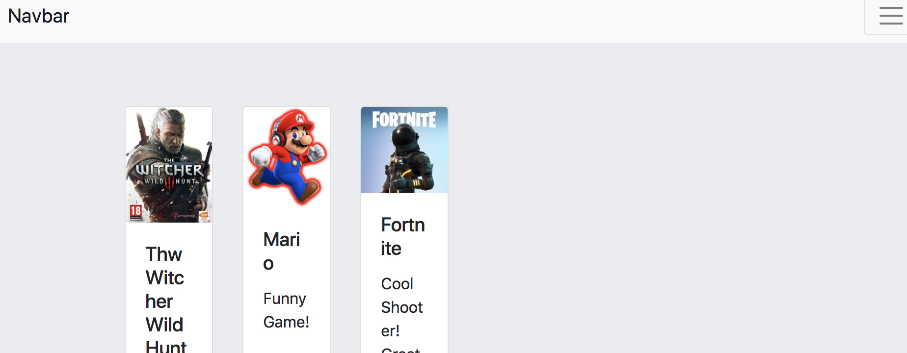

# shop-backend

This project is backend oriented ;) Please don't judge me on this Bootstrap (I hate bootstrap too).

1) `git clone https://github.com/sweettirexkiller/shop-backend.git`
2) `cd shop-backend`
3) `npm install`
4) `nano app.js`

        ...
        mongoose.connect('mongodb://localhost/YOUR_DB_HERE', {promiseLibrary: require('bluebird')});
        ...
        
    `ctrl+O ctrl+X`
 
5) `node seed/product-seed.js`
6) `npm start`
7) [localhost:3000](http://localhost:3000)